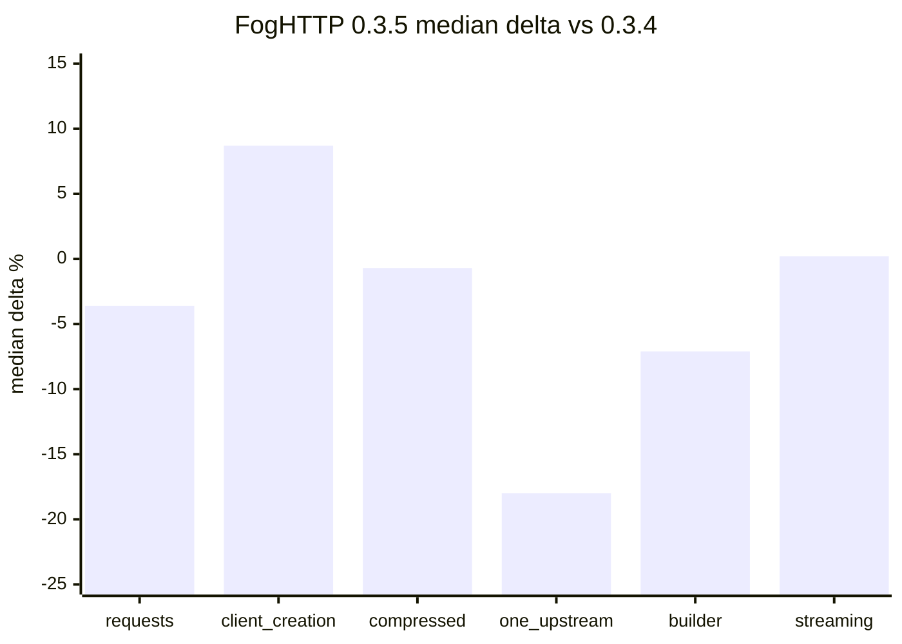
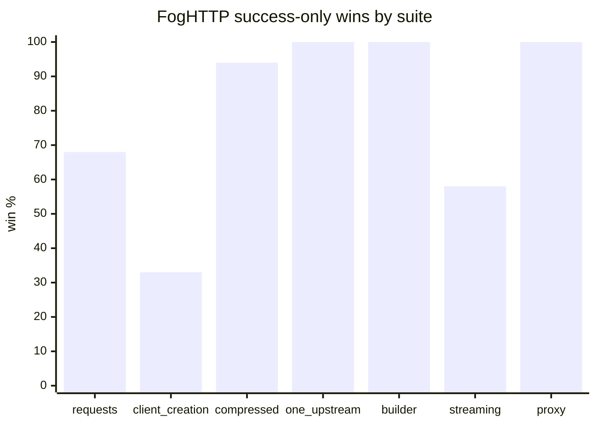

# Benchmarks

Benchmark harness and full benchmark reports live in a separate repository:
[github.com/AmberFog/FogHttpBenchmark](https://github.com/AmberFog/FogHttpBenchmark).

This page is a benchmark status snapshot, not a marketing scoreboard. Invalid
rows, compatibility gaps, resource-limit errors, and weak spots stay visible
because they are the inputs we use to improve FogHTTP.

Last updated: `2026-07-02`.

## Methodology

- Server: local asyncio HTTP/1.1 loopback server, plus local HTTPS/proxy
  fixtures for the proxy suite.
- Primary benchmark host: `macOS-26.5.1-arm64-arm-64bit-Mach-O`.
- Python: `3.14.0`.
- Shuffle seed: `20260507`.
- Full-run isolation: sequential subprocesses per client/scenario.
- Child cooldown: `15.0s`.
- Run settling: `3.0s` cooldown after high-connection children when opened
  connections exceed `256`.
- Higher `ok/s`, `ops/s`, `req/s`, successful `streams/s`, `MiB/s`, or
  `lines/s` is better.
- Lower `p95 ms`, `p99 ms`, threads, fds, and error counts are better.
- Throughput and latency comparisons are only meaningful for rows with `0`
  measured errors and `0` warmup errors.
- Resource/backpressure suites intentionally trigger `PoolTimeout`,
  `ResponseBodyTooLargeError`, and `ResponseBodyBudgetExceededError`; those are
  expected resource-control outcomes, not benchmark harness failures.
- Reports with `needs-rerun` validity are diagnostic evidence. They must not be
  used as strong all-client performance baselines until the reason is
  classified or rerun.

## Current Source Snapshots

Primary benchmark data source for this page:

- Result directory:
  `results/full-pypi-foghttp-0.3.5-settled-20260702-200414`.
- Package versions: FogHTTP `0.3.5`, aiohttp `3.14.0`, httpx `0.28.1`,
  httpxyz `0.31.2`, zapros `0.13.0`.
- Platform: `macOS-26.5.1-arm64-arm-64bit-Mach-O`.
- Python: `3.14.0`.

Historical comparison sources:

| Role | Result directory | Use |
| --- | --- | --- |
| Current release run | `results/full-pypi-foghttp-0.3.5-settled-20260702-200414` | Primary FogHTTP `0.3.5` evidence after run-settling. |
| Previous release baseline | `results/full-current-deps-foghttp-0.3.4-20260607-121844` | Matching-row comparison against FogHTTP `0.3.4` on the same primary host lineage. |
| Valid proxy/CONNECT baseline | `results/proxy-connect-0.3.4-isolated-full-20260607-213445` | Previous proxy/CONNECT baseline for stability comparison. |
| Earlier 0.3.5 attempts | `results/full-pypi-foghttp-0.3.5-20260702-162612`, `results/full-pypi-foghttp-0.3.5-rerun-20260702-172113`, `results/full-pypi-foghttp-0.3.5-settled-20260702-183136` | Diagnostic evidence that run settling removed false FogHTTP error contamination in request-style suites. |

Absolute throughput, latency, memory, thread, and fd values are compared only
within the same host/result lineage. Older external-host diagnostic runs are not
mixed into the `0.3.5` release summary.

## Release-Level Read

FogHTTP `0.3.5` does not show a broad functional regression in the final settled
run. FogHTTP rows are clean in the request, one-upstream, compression, proxy,
request-builder, client-lifecycle, and streaming suites. Resource/backpressure
errors are expected pressure outcomes, and recovery failures remain `0`.

The performance picture is more mixed. Client lifecycle improved versus the
`0.3.4` baseline, proxy/CONNECT is stable, compression and streaming are mostly
flat, but request-body-heavy paths now show meaningful drift. The strongest
current optimization target is the POST/request-body path introduced or touched
by the `0.3.5` upload work.

| Suite | Validity | FogHTTP clean rows | FogHTTP median delta vs `0.3.4` | p95 delta vs `0.3.4` | Competitive result | Current judgement |
| --- | --- | ---: | ---: | ---: | --- | --- |
| `requests` | `needs-rerun` due to zapros `redirect-post-307` failures | `88/88` | `-3.6%` | `+7.8%` | wins `60/88` | Median drift is mild, but POST and redirect-POST rows contain large regressions around `-50%`; investigate request-body overhead. |
| `client-creation` | `warning` from one high-variation zapros row | `12/12` | `+8.7%` | `-10.6%` | wins `4/12` | Improved versus `0.3.4`, but still not a competitive strength. |
| `compressed-response` | `needs-rerun` due to aiohttp/zapros multi-encoding failures | `36/36` | `-0.7%` | `-0.5%` | wins `34/36` | Broadly stable and still strong; high-concurrency `gzip`/`deflate` 64 KiB rows need a focused check. |
| `one-upstream` | `warning` from httpx high-variation rows | `64/64` | `-18.0%` | `+35.8%` | wins `64/64` | Still wins every group, but the drift is too large to ignore; POST/form/json cases are the main suspects. |
| `request-builder` | `valid` | `20/20` | `-7.1%` | `+12.7%` | wins `20/20` | Still a strength, but the Python-side build path got measurably slower. |
| `response-streaming` | `needs-rerun` due to aiohttp `long-line-1m` failures | `60/60` | `+0.2%` | `+2.0%` | wins `35/60` | Mostly stable; sync `first-chunk-close-1m` and `stream-1m` remain focused weak spots. |
| `proxy-connect` | `valid` | `42/42` | about flat vs previous proxy baseline | about flat | wins `42/42` | Proxy and HTTPS CONNECT remain clean and stable. |
| `resource-backpressure` | `valid` | expected pressure errors | n/a | about flat | FogHTTP-only | Bounded-resource semantics are stable; `recovery_failures = 0`. |

## Validity And Run Settling

The final settled run is materially better than the earlier `0.3.5` attempts.
The first two full runs recorded large FogHTTP error counts in `requests` and
`one-upstream`. After adding run-settling, the final run has `0` FogHTTP measured
and warmup errors in those suites.

This is an important benchmark-harness conclusion: the earlier FogHTTP error
rows were not stable evidence of a runtime regression. They were contamination
from insufficient process/server settling between heavy isolated children.

The remaining `needs-rerun` statuses are competitor/case compatibility issues:

- `requests`: zapros fails `redirect-post-307` rows.
- `compressed-response`: aiohttp and zapros fail `multi-gzip-deflate-64k`.
- `response-streaming`: aiohttp fails async `long-line-1m` line streaming.

FogHTTP rows are clean in all three suites, so these statuses should not be read
as FogHTTP functional failures. They do mean that hard all-client regression
gates still need expected-compatibility classification.

## Request And One-Upstream Drift

The main new weak signal is request-body-heavy throughput:

- In `requests`, the matching-row median is only `-3.6%`, but the worst rows are
  concentrated around POST and redirect-POST paths.
- Examples from matching FogHTTP rows versus `0.3.4`:
  - async `redirect-post-307`, concurrency `50`: about `-52%`;
  - async `redirect-post-303`, concurrency `50`: about `-51%`;
  - async `post-json-echo`, concurrency `10`: about `-51%`;
  - sync `post-echo-64k`, concurrency `10`: about `-50%`;
  - sync `post-json-echo`, concurrency `1`: about `-50%`.
- In `one-upstream`, the median matching-row delta is `-18.0%`, with the worst
  rows concentrated in POST form/json cases.

This lines up with the `0.3.5` release scope: streaming uploads and multipart
support changed the body-provider path. The current evidence does not show
broken behavior, but it does justify a focused optimization pass around
request-body construction, upload body dispatch, and POST redirect handling.

## Proxy And CONNECT

The proxy suite is the cleanest `0.3.5` signal:

- Validity: `valid`.
- FogHTTP rows: `42/42` clean.
- Median successful request throughput:

| Client | Median `req/s` across proxy suite rows |
| --- | ---: |
| FogHTTP | `4480.1` |
| httpxyz | `1446.0` |
| httpx | `1211.5` |

The previous valid `0.3.4` proxy baseline had FogHTTP median `4471.3 req/s`, so
the proxy/CONNECT path is effectively flat. The release signal is not only
speed: explicit proxy routing, `trust_env`, HTTPS CONNECT, and cold CONNECT
setup all remain functionally clean under isolated execution.

## Resource And Backpressure

`resource-backpressure` is valid. FogHTTP intentionally produces pressure
errors in the pressure scenarios, and those errors remain observable:

| Scenario | Measured errors | Warmup errors | Recovery failures | Main expected outcome |
| --- | ---: | ---: | ---: | --- |
| `active-limit-serial` | `0` | `0` | `0` | Serial active-limit behavior remains clean. |
| `per-origin-isolation` | `0` | `0` | `0` | Per-origin pressure isolation remains clean. |
| `pending-queue-full` | `4800` | `1200` | `0` | Expected pool pressure / queue-full behavior. |
| `pool-timeout-recovery` | `3533` | `873` | `0` | Expected pool timeouts with clean recovery. |
| `response-body-limit` | `4800` | `1200` | `0` | Expected response body limit rejections. |
| `aggregate-buffered-budget` | `3583` | `884` | `0` | Expected aggregate buffered budget rejections. |

The important part is `recovery_failures = 0`. The suite is doing its job:
resource limits reject work, then the client recovers.

## Streaming

Streaming is mostly stable in aggregate:

- FogHTTP rows: `60/60` clean.
- Median matching-row delta vs `0.3.4`: `+0.2%`.
- Median p95 delta: `+2.0%`.

The focused weak spots remain:

- sync `first-chunk-close-1m` is down about `-34%` at concurrency `10` and
  about `-30%` at concurrency `50`;
- sync `stream-1m` is down about `-15%` at concurrency `50`;
- `first-chunk-close-1m` has high peak RSS in the isolated child
  (`1430.5 MiB` for FogHTTP in the final run).

The RSS signal should be treated as an investigation lead, not as a confirmed
leak. The scenario can stress server/client buffering and early-close cleanup
across all clients. It still deserves a targeted streaming memory/profile run.

## Strong Areas

- Proxy and HTTPS CONNECT are valid, clean, and effectively flat versus the
  previous proxy baseline.
- One-upstream still wins every success-only group despite the performance
  drift.
- Request building still wins every group, even after the `-7.1%` drift.
- Buffered compression remains functionally strong and keeps stacked-encoding
  compatibility where some competitors fail.
- Resource/backpressure behavior remains explicit and recoverable.
- Final run-settling removed the false FogHTTP error contamination seen in
  earlier 0.3.5 attempts.

## Weak Spots And Follow-Ups

| Area | Signal | What to do next |
| --- | --- | --- |
| Request body / POST path | `requests` POST and redirect-POST rows show large matching-row drops, and `one-upstream` is down `-18.0%` median. | Profile upload/body-provider dispatch, body encoding, header/body preparation, and redirect-POST handling after the `0.3.5` upload work. |
| Request builder | Valid suite, still winning, but median `-7.1%` and p95 `+12.7%` versus `0.3.4`. | Inspect Python-side request construction changes and avoid adding body/multipart overhead to no-upload paths. |
| Streaming early close | Median streaming is flat, but sync first-chunk-close and stream-1m regressions remain. | Run targeted early-close profiling with RSS/fd/thread tracking and separate server-buffer effects from client cleanup cost. |
| Benchmark validity policy | Three all-client suites remain `needs-rerun` because competitor/case failures are not yet classified. | Add expected-compatibility policy for zapros redirect POST, aiohttp long-line streaming, and multi-encoding failures. |
| Client lifecycle competitiveness | Improved versus `0.3.4`, but wins only `4/12`. | Keep as a secondary optimization target after the request-body regression candidate. |

## Current Engineering Conclusion

FogHTTP `0.3.5` successfully adds upload-heavy workload functionality without a
broad functional benchmark regression. The final settled run shows clean
FogHTTP rows across request, one-upstream, compression, proxy, builder,
client-lifecycle, and streaming suites.

The honest performance read is narrower: the release likely introduced overhead
on request-body-heavy paths. The next optimization work should focus on POST,
body construction, upload-provider dispatch, and request-building overhead before
chasing broader runtime changes. Proxy/CONNECT and resource-control behavior are
stable; streaming needs a targeted early-close memory/profile investigation.
