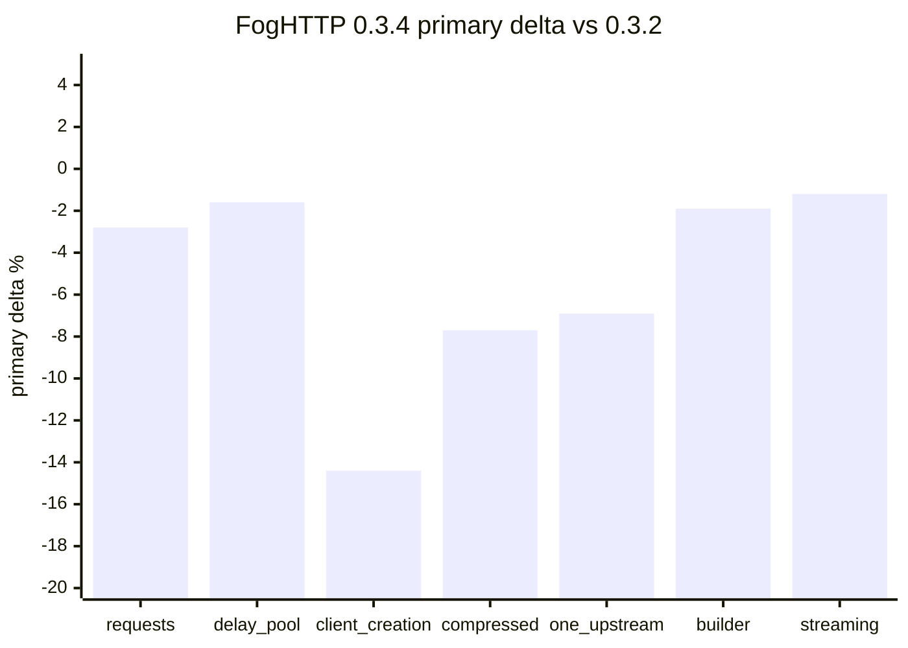
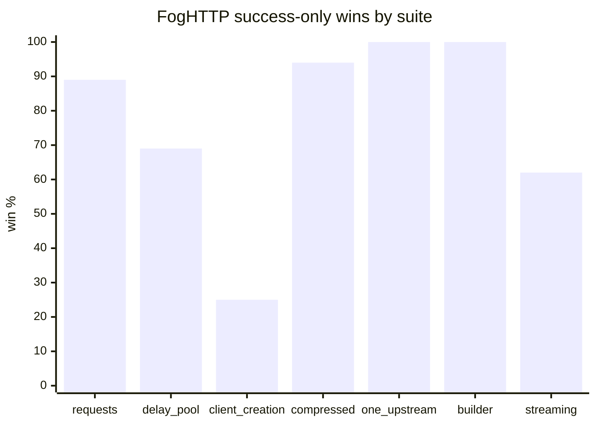

# Benchmarks

Benchmark harness and full benchmark reports live in a separate repository:
[github.com/AmberFog/FogHttpBenchmark](https://github.com/AmberFog/FogHttpBenchmark).

This page is a benchmark status snapshot, not a marketing scoreboard. Invalid
rows, compatibility gaps, resource-limit errors, and weak spots stay visible
because they are the inputs we use to improve FogHTTP.

Last updated: `2026-06-08`.

## Methodology

- Server: local asyncio HTTP/1.1 loopback server, plus local HTTPS/proxy
  fixtures for the proxy suite.
- Python: `3.14.0` on the primary benchmark host.
- Shuffle seed: `20260507`.
- Higher `ok/s`, `ops/s`, `req/s`, successful `streams/s`, `MiB/s`, or
  `lines/s` is better.
- Lower `p95 ms`, `p99 ms`, threads, fds, and error counts are better.
- Throughput and latency comparisons are only meaningful for rows with `0`
  measured errors and `0` warmup errors.
- Resource/backpressure suites intentionally trigger `PoolTimeout`,
  `ResponseBodyTooLargeError`, and `ResponseBodyBudgetExceededError`; those are
  expected resource-control outcomes, not benchmark harness failures.
- Reports with `needs-rerun` or `invalid` validity are diagnostic evidence. They
  must not be used as strong performance baselines until the reason is
  classified or rerun.

## Benchmark Hosts

Primary benchmark data source for this page:

- Result directories:
  `results/full-current-deps-foghttp-0.3.4-20260607-121844`,
  `results/full-branch-opt-pipeline-20260607-230009`, and
  `results/proxy-connect-0.3.4-isolated-full-20260607-213445`.
- Platform: `macOS-26.5.1-arm64-arm-64bit-Mach-O`.
- Python: `3.14.0`.
- Server: local asyncio HTTP/1.1 loopback server; proxy suite additionally uses
  local HTTPS origin and local HTTP proxy fixtures.
- Package versions: FogHTTP `0.3.4`, aiohttp `3.14.0`, httpx `0.28.1`,
  httpxyz `0.31.2`, zapros `0.13.0`.

Secondary diagnostic host:

- Result directory: `results/dvorkin-opt_pipeline-20260607-230859`.
- Platform: `macOS-15.7.7-x86_64-i386-64bit-Mach-O`.
- Python: `3.13.7`.
- Package versions match the primary host for the clients listed above.

Absolute throughput, latency, memory, thread, and fd values are compared only
within the same host/result lineage. The secondary host is used as a relative
sanity check: it can confirm whether broad client ranking patterns repeat, but
it is not mixed into release delta charts or absolute performance conclusions.

## Current Source Snapshots

| Role | Result directory | Status | Use |
| --- | --- | --- | --- |
| Latest release comparison | `results/full-current-deps-foghttp-0.3.4-20260607-121844` | legacy report, before the new validity gate metadata | Release-to-release signal versus `0.3.2`; useful, but dependency and harness changes mean attribution is not perfect. |
| Primary branch evidence | `results/full-branch-opt-pipeline-20260607-230009` | mixed: valid/warning/needs-rerun by suite | Primary host execution evidence for the current benchmark harness. FogHTTP rows are clean in the local problematic suites, but some all-client reports need policy/rerun work before becoming strong baselines. |
| Secondary host diagnostic run | `results/dvorkin-opt_pipeline-20260607-230859` | diagnostic; some suites `needs-rerun` | Relative cross-host sanity check only. External-only failures are not treated as FogHTTP runtime regressions until targeted reruns classify them. |
| Valid proxy/CONNECT baseline | `results/proxy-connect-0.3.4-isolated-full-20260607-213445` | valid | Strong functional proxy/CONNECT baseline: `126` aggregate rows, `378` runs, `21` isolated child processes, `0` measured/warmup errors. |

## Release-Level Read

FogHTTP `0.3.4` does not show a broad functional regression in the local release
baseline: normal request, client, compression, one-upstream, request-builder,
and response-streaming FogHTTP rows have no unexpected errors. The clear
engineering picture is performance drift in a few areas, not broken runtime
semantics.

| Suite | FogHTTP primary delta vs `0.3.2` | p95 delta vs `0.3.2` | Competitive result | Current judgement |
| --- | ---: | ---: | --- | --- |
| `requests` | `-2.8%` | `+4.3%` | wins `64/72` | Mild aggregate drift, but the primary branch run shows recovery; keep as watch suite. |
| `requests-delay-pool` | `-1.6%` | `+1.5%` | wins `11/16` | Mostly stable under delayed/constrained request workloads. |
| `client-creation` | `-14.4%` | `+24.3%` | wins `3/12` | Main confirmed regression candidate; short-lived client lifecycle got more expensive. |
| `compressed-response` | `-7.7%` | `+9.1%` | wins `34/36` | Still strong and error-free for FogHTTP, but buffered decompression throughput drift needs validation. |
| `one-upstream` | `-6.9%` | `+9.4%` | wins `48/48` | Still one of the strongest FogHTTP paths, but local drift needs a controlled rerun. |
| `request-builder` | `-1.9%` | `+4.7%` | wins `20/20` | Stable overall; prepared send path should be watched. |
| `response-streaming` | `-1.2%` | `+2.5%` | wins `37/60` | Competitive position improved, but async early-close remains a focused weak spot. |

## Primary Branch Evidence

The primary host branch run,
`results/full-branch-opt-pipeline-20260607-230009`, completed all local suites
with `0` failed isolated child processes. That is good execution evidence for
the harness and for FogHTTP's basic runtime stability.

It is not yet a strong comparison baseline:

- `compressed-response` is `needs-rerun` because `aiohttp` and `zapros` fail
  `multi-gzip-deflate-64k`; FogHTTP rows have `0` measured and warmup errors.
- `requests` is `needs-rerun` because competitor/case rows fail, including
  `zapros` redirects and `aiohttp` pool-contention rows; FogHTTP rows have `0`
  measured and warmup errors.
- `response-streaming` is `needs-rerun` because `aiohttp` rejects
  `long-line-1m`; FogHTTP rows have `0` measured and warmup errors.
- `client-creation` and `one-upstream` are `warning`, mostly from high
  variation rows.
- `request-builder`, `resource-backpressure`, and `proxy-connect` are valid.

This means the primary branch run is healthy enough to guide investigation, but the
benchmark project still needs expected-compatibility policy and baseline-split
work before these all-client reports should drive hard regression gates.

## Secondary Host Evidence

The external `dvorkin` run is a relative sanity check. It is not used for
absolute performance numbers on this page. It shows two important diagnostic
signals:

- External `one-upstream` is `needs-rerun` from FogHTTP `direct-get`
  `RequestError` rows, including a high-error row around `99.97%`. The same
  failure does not reproduce in the local loopback run, so this is an
  external-host reproducibility problem until targeted reruns prove otherwise.
- External `proxy-connect` is `needs-rerun` from `httpx` HTTPS/proxy failures.
  FogHTTP proxy rows are clean in that run, so this is not evidence of a
  FogHTTP proxy regression.

The correct next step is targeted external reruns and error-family preservation
in aggregate reports, not optimization work based on the invalid secondary-host
summary.

## Proxy And CONNECT

The valid isolated proxy baseline,
`results/proxy-connect-0.3.4-isolated-full-20260607-213445`, is the most
important new `0.3.4` validation signal:

- `126` aggregate rows and `378` measured runs.
- `21` isolated child processes.
- `0` measured errors and `0` warmup errors.
- Coverage includes direct HTTP, explicit HTTP proxy, `trust_env` HTTP proxy,
  direct HTTPS, explicit HTTPS CONNECT, `trust_env` HTTPS CONNECT, and cold
  CONNECT setup.

Median successful request throughput by client in the local proxy suite:

| Client | Median `req/s` across proxy suite rows |
| --- | ---: |
| FogHTTP | `4471.7` |
| httpxyz | `1578.5` |
| httpx | `1209.6` |

This is not only a speed result. The more important release signal is that the
new proxy/CONNECT paths are functionally stable under isolated all-client
execution. The known limitation remains that separate proxy-endpoint telemetry
is not exposed yet; current connection and pool diagnostics are target-origin
keyed.

## Strong Areas

- Buffered local request workloads remain competitive, especially sync request
  paths and high-concurrency rows.
- Client defaults and one-upstream ergonomics remain cheap: the release baseline
  wins `48/48` one-upstream groups.
- Request building is still a strength: the release baseline wins `20/20`
  groups.
- Buffered gzip/deflate/br decompression is functionally strong and keeps
  stacked-encoding compatibility where some competitors fail.
- Proxy and HTTPS CONNECT are now covered by a valid isolated suite with clean
  FogHTTP rows.
- Resource/backpressure behavior is explicit: bounded response-body and pool
  pressure errors are expected outcomes and are visible in the reports.

## Weak Spots And Follow-Ups

| Area | Signal | What to do next |
| --- | --- | --- |
| Client lifecycle | `client-creation` release baseline shows `-14.4%` primary delta and `+24.3%` p95 delta vs `0.3.2`. | Validate under the current validity-gated harness, then profile client/runtime setup and close paths. |
| Buffered/API throughput | `compressed-response` and `one-upstream` remain strong competitively but show release-level drift. | Rerun with controlled dependencies and split strong baseline rows from compatibility rows. |
| Streaming early close | Overall streaming improved, but async `first-chunk-close-1m` regressed in the release comparison. | Investigate early close/abort cleanup path separately from full-consume streaming. |
| External reproducibility | External `one-upstream` FogHTTP `direct-get` errors do not reproduce locally. | Add targeted external rerun workflow before calling this a FogHTTP runtime issue. |
| Benchmark reporting | Some aggregate reports lose enough error-family detail to classify expected competitor failures cleanly. | Preserve aggregate error metadata, then add expected-compatibility policy and regression gates. |

## Current Engineering Conclusion

FogHTTP `0.3.4` added the adoption-critical proxy and HTTPS CONNECT surface, and
that path is now covered by a valid isolated benchmark. The core
request/streaming/resource behavior remains functionally clean in local FogHTTP
rows.

The honest caveat is performance validation. The project should not optimize
against invalid all-client summaries or external-host anomalies. The benchmark
work should first harden validity metadata, expected compatibility policy,
strong-baseline splitting, and targeted external reruns. After that, the real
runtime optimization targets are client lifecycle cost, buffered/API drift, and
streaming early-close overhead.
