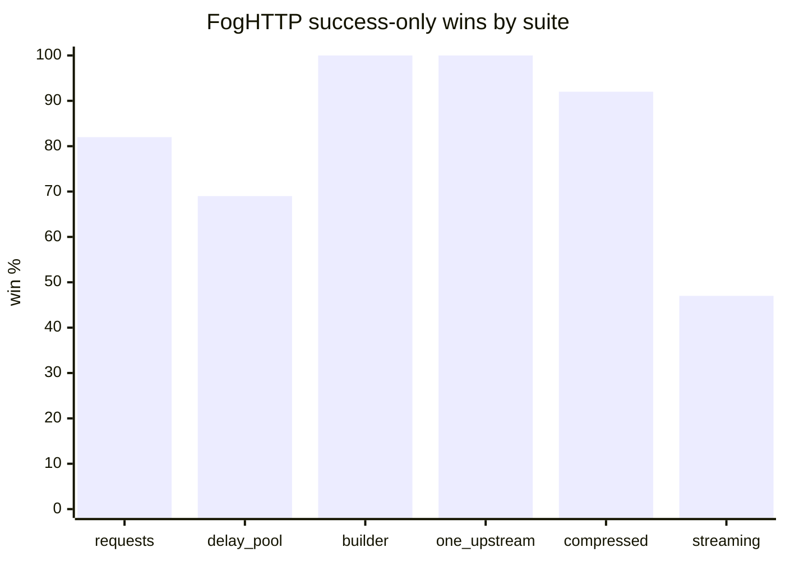
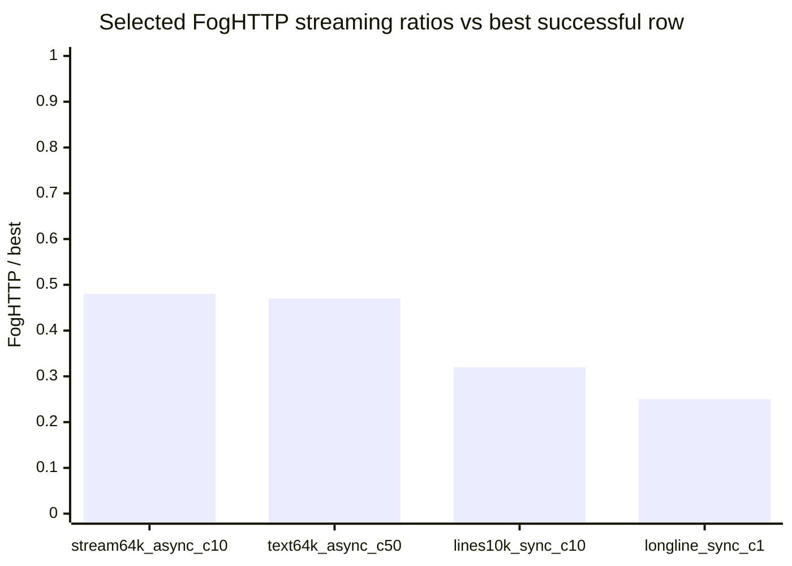
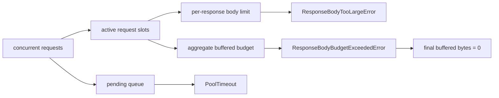

# Benchmarks

Benchmark harness and full benchmark reports live in a separate repository:
[github.com/AmberFog/FogHttpBenchmark](https://github.com/AmberFog/FogHttpBenchmark).

The tables below are copied summary snapshots from that repository. They are
useful for release-to-release and client-to-client comparisons, but they are
local loopback benchmarks, not a universal prediction for real network latency.

This page is intentionally not a marketing scoreboard. Failed rows, skipped
clients, memory/resource limits, and known weak spots stay visible because they
are part of the engineering feedback loop.

## Methodology

- Server: local asyncio HTTP/1.1 loopback server.
- Platform: `macOS-26.5-arm64-arm-64bit-Mach-O`.
- Python: `3.14.0`.
- Shuffle seed: `20260507`.
- Latest snapshot directory:
  `results/full-foghttp-0.3.2-pypi-20260527-194316`.
- `sync:aiohttp` is skipped because aiohttp is async-only.
- Some suites skip clients that do not expose comparable APIs.
- Higher `ok/s`, `ops/s`, or successful `streams/s` is better.
- Lower `p95 ms`, threads, fds, and errors are better.
- Throughput and latency rows are only comparable when the row has `0`
  measured errors and `0` warmup errors.
- Rows with failures are treated as compatibility, reliability, or safety
  signals, not as successful throughput wins.
- Resource/backpressure suites intentionally trigger `PoolTimeout`,
  `ResponseBodyTooLargeError`, and `ResponseBodyBudgetExceededError`; those are
  expected rejections, not failed benchmark runs.

## Snapshots

| Suite | Snapshot | Aggregate rows | Runs |
|---|---:|---:|---:|
| request workloads | `20260527-194741` | `324` | `972` |
| client creation | `20260527-194755` | `54` | `162` |
| resource/backpressure | `20260527-194955` | `36` | `108` |
| compressed response | `20260527-195433` | `162` | `486` |
| one upstream | `20260527-195934` | `144` | `432` |
| request builder | `20260527-200027` | `60` | `180` |
| response streaming | `20260527-201032` | `210` | `630` |
| delay/pool requests | `20260527-202555` | `72` | `216` |

## Versions

| Package | Version |
|---|---:|
| FogHTTP | `0.3.2` |
| aiohttp | `3.13.5` |
| httpx | `0.28.1` |
| httpxyz | `0.31.2` |
| zapros | `0.11.1` |

## Current Read

FogHTTP `0.3.2` looks strong on buffered request workloads, request building,
client defaults, compressed buffered responses, and bounded resource behavior.
The main weak area is response streaming, especially async short streams and
full line iteration.

| Area | What the latest run shows | Follow-up |
|---|---|---|
| Buffered requests | FogHTTP wins `59/72` successful request rows; sync wins `36/36`. | Keep watching async small JSON/POST rows where aiohttp is faster at `conc=1`. |
| Request builder | FogHTTP wins `20/20` build/prepared rows against httpx/httpxyz. | Stable; avoid unnecessary hot-path churn. |
| One upstream defaults | FogHTTP wins `48/48`; `base_url`, default headers/params, and prepared requests are cheap. | Stable foundation for API ergonomics. |
| Compressed responses | FogHTTP wins `33/36` success-only rows and passes stacked encodings. | Strong buffered feature; streaming decompression is still separate future work. |
| Resource/backpressure | Limits behave predictably; final buffered bytes return to `0`; recovery failures are `0`. | Continue using this suite as a safety gate. |
| Response streaming | FogHTTP wins `28/60` success-only rows; async wins only `8/30`. | Optimize async delivery and line iteration without hidden buffering. |

## Request Workloads

Requests/run: `500`, warmup/run: `50`, repeats: `3`,
concurrency: `1,10,50,100`.

Scenarios: `json-small`, `json-decode-small`, `bytes-64k`,
`post-json-echo`, `post-echo-64k`, `redirect-get-302`,
`redirect-head-302`, `redirect-post-303`, `redirect-post-307`.

| Mode | Client | Wins | Median ok/s | Median p95 ms | Max threads | Max fds | Errors |
|---|---|---:|---:|---:|---:|---:|---:|
| async | aiohttp | `13/36` | `8020.5` | `3.82` | `2` | `207` | `0` |
| async | FogHTTP | `23/36` | `11286.1` | `2.13` | `18` | `210` | `0` |
| async | httpx | `0/36` | `1729.5` | `14.57` | `2` | `207` | `0` |
| async | httpxyz | `0/36` | `1735.1` | `14.59` | `2` | `207` | `0` |
| async | zapros | `0/36` | `4021.8` | `7.02` | `2` | `257` | `0` |
| sync | FogHTTP | `36/36` | `9147.0` | `3.44` | `118` | `234` | `0` |
| sync | httpx | `0/36` | `1179.2` | `23.52` | `102` | `109` | `0` |
| sync | httpxyz | `0/36` | `1180.9` | `19.94` | `102` | `109` | `0` |
| sync | zapros | `0/36` | `3339.1` | `8.46` | `102` | `282` | `0` |

FogHTTP is clearly competitive here. The honest weak spot is not the general
buffered path, but a few async low-concurrency rows where aiohttp has lower
fixed overhead for small request/response pairs.

## Delay And Pool Workloads

Requests/run: `500`, warmup/run: `50`, repeats: `3`,
concurrency: `1,10,50,100`.

Scenarios: `delay-20ms`, `pool-contention-20ms`.

| Mode | Client | Wins | Median ok/s | Median p95 ms | Max threads | Max fds | Errors |
|---|---|---:|---:|---:|---:|---:|---:|
| async | aiohttp | `3/8` | `408.7` | `27.20` | `2` | `207` | `0` |
| async | FogHTTP | `4/8` | `425.2` | `26.64` | `18` | `210` | `0` |
| async | httpx | `1/8` | `285.5` | `524.78` | `2` | `107` | `0` |
| async | httpxyz | `0/8` | `343.3` | `36.79` | `2` | `207` | `0` |
| async | zapros | `0/8` | `384.5` | `30.70` | `2` | `207` | `0` |
| sync | FogHTTP | `7/8` | `425.5` | `24.56` | `118` | `210` | `0` |
| sync | httpx | `0/8` | `200.5` | `121.13` | `102` | `207` | `0` |
| sync | httpxyz | `1/8` | `297.2` | `76.88` | `102` | `207` | `0` |
| sync | zapros | `0/8` | `400.1` | `27.62` | `102` | `207` | `0` |

FogHTTP is close to the best async result and strong in sync mode. This suite
matters because the project is aimed at predictable concurrency, not only
maximum localhost throughput.

## Client Creation And First Request

Iterations/run: `100`, client counts: `1,10,50`, repeats: `3`.

Scenarios: `create-close`, `create-first-request`,
`many-clients-open-close`, `reused-request`.

| Mode | Client | Wins | Median ops/s | Median p95 ms | Peak threads | Peak fds | Errors |
|---|---|---:|---:|---:|---:|---:|---:|
| async | aiohttp | `1/6` | `18300.5` | `0.051` | `0` | `2` | `0` |
| async | FogHTTP | `2/6` | `34478.6` | `0.032` | `1` | `5` | `0` |
| async | httpx | `0/6` | `354.0` | `2.813` | `0` | `2` | `0` |
| async | httpxyz | `0/6` | `352.5` | `2.851` | `0` | `2` | `0` |
| async | zapros | `3/6` | `35836.9` | `0.019` | `0` | `2` | `0` |
| sync | FogHTTP | `2/6` | `30186.1` | `0.036` | `1` | `5` | `0` |
| sync | httpx | `0/6` | `361.0` | `2.832` | `0` | `2` | `0` |
| sync | httpxyz | `0/6` | `357.0` | `2.926` | `0` | `2` | `0` |
| sync | zapros | `4/6` | `38112.9` | `0.018` | `0` | `2` | `0` |

Short-lived client creation is not the primary production usage pattern, but it
is still worth watching. FogHTTP is much faster than httpx/httpxyz in this
suite, while zapros remains better on several minimal lifecycle rows.

## Request Builder

Iterations/run: `5000`, warmup/run: `500`, repeats: `3`.

This suite measures request construction without network I/O, plus a prepared
request send case through the local loopback server. aiohttp and zapros are
skipped because the suite requires comparable `build_request` support.

| Mode | Client | Kind | Rows | Median ops/s | Median p95 ms | Max threads | Max fds | Errors |
|---|---|---|---:|---:|---:|---:|---:|---:|
| async | FogHTTP | build | `9` | `149845.7` | `0.0069` | `3` | `8` | `0` |
| async | FogHTTP | send-prepared | `1` | `7944.3` | `0.1844` | `4` | `12` | `0` |
| async | httpx | build | `9` | `42722.0` | `0.0309` | `3` | `8` | `0` |
| async | httpx | send-prepared | `1` | `2107.7` | `0.6565` | `3` | `9` | `0` |
| async | httpxyz | build | `9` | `43938.1` | `0.0294` | `3` | `8` | `0` |
| async | httpxyz | send-prepared | `1` | `2177.7` | `0.5535` | `3` | `9` | `0` |
| sync | FogHTTP | build | `9` | `149884.2` | `0.0069` | `3` | `7` | `0` |
| sync | FogHTTP | send-prepared | `1` | `10202.4` | `0.1345` | `4` | `12` | `0` |
| sync | httpx | build | `9` | `44614.3` | `0.0276` | `3` | `7` | `0` |
| sync | httpx | send-prepared | `1` | `3478.3` | `0.3773` | `3` | `9` | `0` |
| sync | httpxyz | build | `9` | `42714.5` | `0.0295` | `3` | `7` | `0` |
| sync | httpxyz | send-prepared | `1` | `3546.6` | `0.3292` | `3` | `9` | `0` |

Request construction remains a strong area. This supports the current
Python-first API direction: base URL, params, headers, and body selection are
not making the request builder a bottleneck.

## One Upstream Client Defaults

Requests/run: `1000`, warmup/run: `100`, repeats: `3`,
concurrency: `1,10,50`.

This suite compares direct requests with `base_url`, client defaults, prepared
requests, JSON bodies, and form bodies against one upstream. aiohttp and zapros
are skipped because the suite requires comparable client default support.

| Mode | Client | Wins | Median ok/s | Median p95 ms | Max threads | Max fds | Errors |
|---|---|---:|---:|---:|---:|---:|---:|
| async | FogHTTP | `24/24` | `9603.6` | `1.24` | `18` | `110` | `0` |
| async | httpx | `0/24` | `1549.2` | `5.98` | `2` | `107` | `0` |
| async | httpxyz | `0/24` | `2127.6` | `4.60` | `2` | `107` | `0` |
| sync | FogHTTP | `24/24` | `10327.1` | `1.01` | `68` | `110` | `0` |
| sync | httpx | `0/24` | `2019.6` | `6.62` | `52` | `107` | `0` |
| sync | httpxyz | `0/24` | `2062.8` | `6.47` | `52` | `107` | `0` |

Client defaults are currently cheap. This is useful because adoption-facing API
features should not quietly turn the hot path into a heavy Python layer.

## Compressed Responses

Requests/run: `1000`, warmup/run: `100`, repeats: `3`,
concurrency: `1,10,50`.

Scenarios: `gzip-json-small`, `gzip-64k`, `deflate-64k`, `br-64k`,
`gzip-high-ratio-1m`, `multi-gzip-deflate-64k`.

| Mode | Client | Success rows | Wins | Median ok/s | Median p95 ms | Max threads | Max fds | Errors |
|---|---|---:|---:|---:|---:|---:|---:|---:|
| async | aiohttp | `15/18` | `3/15` | `6356.1` | `1.38` | `2` | `107` | `9000` |
| async | FogHTTP | `18/18` | `15/18` | `11984.9` | `0.92` | `18` | `110` | `0` |
| async | httpx | `18/18` | `0/18` | `1662.4` | `5.65` | `2` | `107` | `0` |
| async | httpxyz | `18/18` | `0/18` | `2217.5` | `4.39` | `2` | `107` | `0` |
| async | zapros | `15/18` | `0/15` | `3830.3` | `2.39` | `2` | `157` | `9000` |
| sync | FogHTTP | `18/18` | `18/18` | `14712.0` | `0.72` | `68` | `110` | `0` |
| sync | httpx | `18/18` | `0/18` | `2197.8` | `6.77` | `52` | `107` | `0` |
| sync | httpxyz | `18/18` | `0/18` | `2253.4` | `6.41` | `52` | `107` | `0` |
| sync | zapros | `15/18` | `0/15` | `4204.0` | `3.13` | `52` | `157` | `9000` |

The error totals come from stacked `Content-Encoding` rows for aiohttp and
zapros. They stay in the table because compatibility failures are useful
signals, but they are excluded from successful throughput comparisons.

FogHTTP's buffered decompression path is strong. This does not mean streaming
decompression is solved; streaming gzip/deflate/br remains a separate future
feature with different memory and partial-read semantics.

## Response Streaming

Streams/run: `200`, warmup/run: `50`, repeats: `3`,
concurrency: `1,10,50`.

Scenarios: `stream-64k`, `stream-1m`, `drip-64k-1ms`,
`first-chunk-close-1m`, `text-64k`, `lines-10k`, `drip-lines-1ms`,
`unicode-lines`, `long-line-1m`, `first-line-close-10k`.

| Mode | Client | Success rows | Wins | Median streams/s | Median p95 ms | Max threads | Max fds | Errors |
|---|---|---:|---:|---:|---:|---:|---:|---:|
| async | aiohttp | `27/30` | `16/27` | `1873.8` | `6.68` | `3` | `157` | `1800` |
| async | FogHTTP | `30/30` | `8/30` | `1713.4` | `9.16` | `19` | `138` | `0` |
| async | httpx | `30/30` | `0/30` | `415.4` | `22.86` | `3` | `107` | `0` |
| async | httpxyz | `30/30` | `6/30` | `808.2` | `22.75` | `3` | `129` | `0` |
| sync | FogHTTP | `30/30` | `20/30` | `1384.1` | `9.31` | `69` | `195` | `0` |
| sync | httpx | `30/30` | `2/30` | `548.8` | `19.43` | `53` | `205` | `0` |
| sync | httpxyz | `30/30` | `8/30` | `585.1` | `18.88` | `53` | `207` | `0` |

This suite is the most important new signal. FogHTTP response streaming is
functionally healthy: full-consume rows produce reuse-eligible body outcomes,
early-close rows produce aborted/closed outcomes, and FogHTTP has `0` measured
streaming errors. But performance is uneven:

- full 1 MiB byte streams are good, especially async `stream-1m`;
- early close is healthy and observable;
- async 64 KiB byte and text streams still have high fixed overhead compared
  with aiohttp;
- full line iteration is the largest bottleneck in both sync and async modes.

### Streaming Bottlenecks

The rows below show FogHTTP against the best successful client for selected
weak scenarios. Failed competitor rows, such as aiohttp `LineTooLong`, are not
counted as successful wins.

| Scenario | FogHTTP / best | FogHTTP streams/s | Best client | Best streams/s | FogHTTP p95 ms | Best p95 ms |
|---|---:|---:|---|---:|---:|---:|
| `sync / long-line-1m / c1 / lines / all` | `0.25x` | `149.0` | httpxyz | `595.4` | `6.93` | `2.02` |
| `sync / long-line-1m / c10 / lines / all` | `0.26x` | `151.0` | httpxyz | `574.7` | `67.20` | `17.00` |
| `async / long-line-1m / c10 / lines / all` | `0.30x` | `169.2` | httpxyz | `568.3` | `67.96` | `18.19` |
| `sync / lines-10k / c1 / lines / all` | `0.32x` | `161.6` | httpxyz | `502.4` | `6.34` | `2.20` |
| `sync / lines-10k / c10 / lines / all` | `0.32x` | `160.0` | httpxyz | `495.5` | `63.19` | `20.04` |
| `async / long-line-1m / c50 / lines / all` | `0.33x` | `171.4` | httpxyz | `525.5` | `302.49` | `92.89` |
| `async / lines-10k / c1 / lines / all` | `0.40x` | `148.4` | httpxyz | `373.0` | `6.89` | `2.98` |
| `async / stream-64k / c50 / bytes / all` | `0.46x` | `4549.2` | aiohttp | `9783.5` | `7.44` | `5.31` |
| `async / text-64k / c50 / text / all` | `0.47x` | `4553.6` | aiohttp | `9756.0` | `11.12` | `5.31` |
| `async / stream-64k / c10 / bytes / all` | `0.48x` | `4672.1` | aiohttp | `9635.3` | `1.90` | `1.06` |
| `async / text-64k / c1 / text / all` | `0.51x` | `2438.0` | aiohttp | `4813.6` | `0.41` | `0.19` |

The target for future optimization is not to win every row at any cost. A good
result would be to bring common weak rows closer to `0.8x-1.0x` of the best
successful client while preserving bounded memory, explicit cleanup,
cancellation safety, and honest telemetry.

## Resource And Backpressure Workloads

Requests/run: `200`, warmup/run: `0`, repeats: `3`,
concurrency: `10,50,100`.

Scenarios: `active-limit-serial`, `aggregate-buffered-budget`,
`pending-queue-full`, `per-origin-isolation`, `pool-timeout-recovery`,
`response-body-limit`.

| Mode | Scenario | Total ok | Median errors % | Median p95 ms | Peak active | Peak pending | Peak buffered bytes | Pool timeouts | Budget rejects | Final buffered bytes | Recovery failures | Max threads | Max fds |
|---|---|---:|---:|---:|---:|---:|---:|---:|---:|---:|---:|---:|---:|
| async | active-limit-serial | `1800` | `0.00` | `1068.26` | `1` | `99` | `106` | `0` | `0` | `0` | `0` | `3` | `13` |
| async | aggregate-buffered-budget | `10` | `99.50` | `27.12` | `10` | `90` | `98304` | `0` | `199` | `0` | `0` | `12` | `56` |
| async | pending-queue-full | `0` | `100.00` | `2.78` | `0` | `0` | `0` | `200` | `0` | `0` | `0` | `3` | `11` |
| async | per-origin-isolation | `1800` | `0.00` | `537.93` | `2` | `98` | `212` | `0` | `0` | `0` | `0` | `4` | `15` |
| async | pool-timeout-recovery | `35` | `99.00` | `9.74` | `1` | `99` | `106` | `199` | `0` | `0` | `0` | `3` | `13` |
| async | response-body-limit | `0` | `100.00` | `11.92` | `1` | `99` | `0` | `0` | `0` | `0` | `0` | `3` | `13` |
| sync | active-limit-serial | `1800` | `0.00` | `1056.93` | `1` | `99` | `106` | `0` | `0` | `0` | `0` | `103` | `14` |
| sync | aggregate-buffered-budget | `8` | `99.50` | `26.45` | `10` | `90` | `98304` | `0` | `200` | `0` | `0` | `112` | `62` |
| sync | pending-queue-full | `0` | `100.00` | `0.03` | `0` | `0` | `0` | `200` | `0` | `0` | `0` | `3` | `11` |
| sync | per-origin-isolation | `1800` | `0.00` | `534.30` | `2` | `98` | `212` | `0` | `0` | `0` | `0` | `104` | `15` |
| sync | pool-timeout-recovery | `33` | `99.00` | `7.66` | `1` | `99` | `106` | `199` | `0` | `0` | `0` | `103` | `13` |
| sync | response-body-limit | `0` | `100.00` | `14.16` | `1` | `99` | `0` | `0` | `0` | `0` | `0` | `103` | `13` |

These rows are expected to contain rejections. The important result is that the
resource model is bounded and observable:

- `active-limit-serial` holds active requests at `1`.
- `per-origin-isolation` holds total active requests at `2`.
- `pending-queue-full` fails fast with `PoolTimeout`.
- `pool-timeout-recovery` records expected timeouts and recovery failures stay
  at `0`.
- `response-body-limit` fails with `ResponseBodyTooLargeError`.
- `aggregate-buffered-budget` caps peak buffered bytes at `98304` and returns
  final buffered bytes to `0`.

## Known Bottlenecks

These are the most useful follow-up signals from the latest benchmark run:

- Async short response streaming has fixed overhead. The likely area is the
  Rust/Tokio to Python async delivery path around chunk futures, callbacks, and
  bytes conversion.
- Streaming line iteration is CPU/allocation heavy in both sync and async
  modes. `lines-10k` and `long-line-1m` are the clearest bottlenecks.
- Client creation is fast enough for normal reuse-oriented workloads, but
  zapros is still better in several minimal create/open-close rows.
- Thread count is higher for FogHTTP sync concurrency because sync calls bridge
  into the Rust runtime from Python worker threads. This is expected today, but
  it remains an operational trade-off to watch.

The optimization goal is to reduce these gaps without hidden full-body
buffering, without weakening cancellation or cleanup semantics, and without
turning the default hot path into a Python callback framework.
