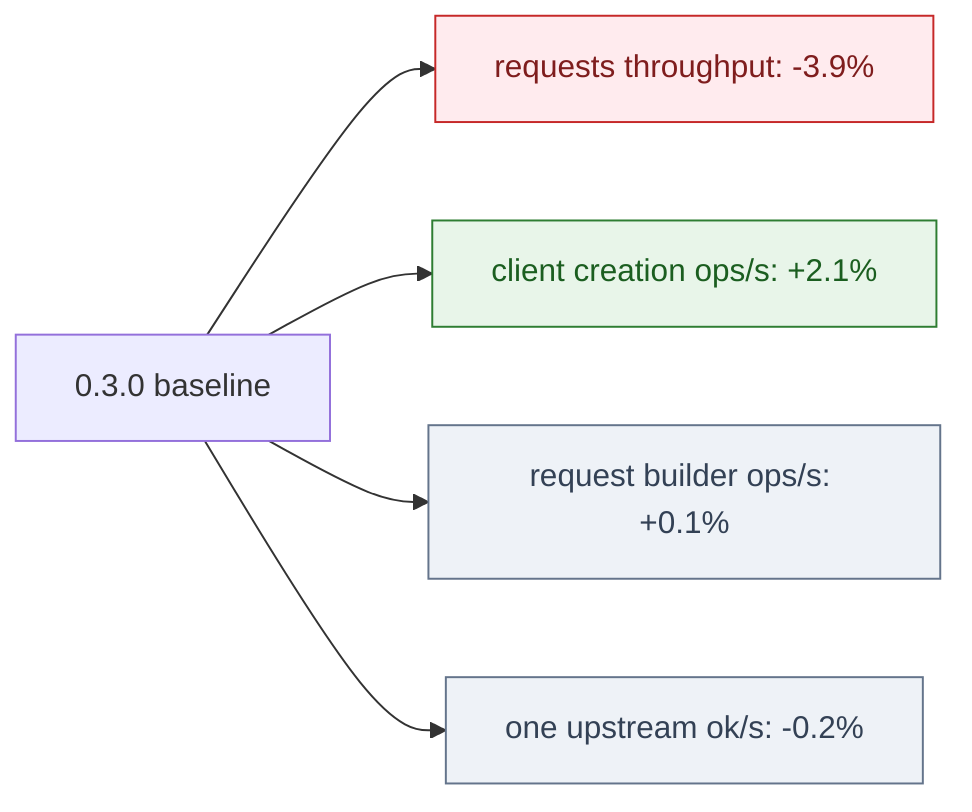
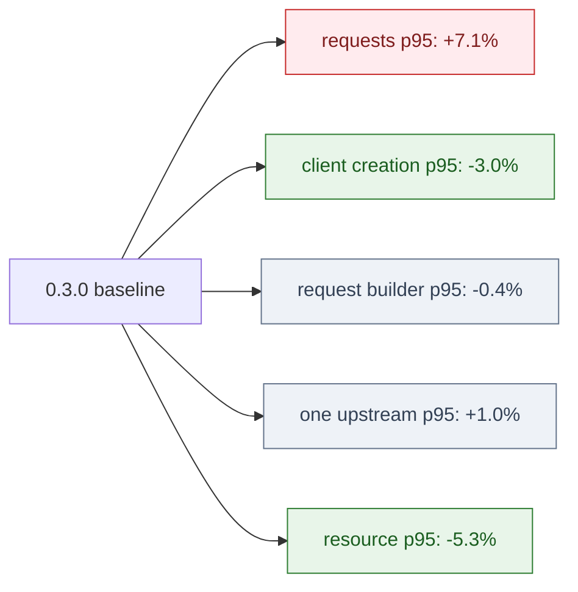
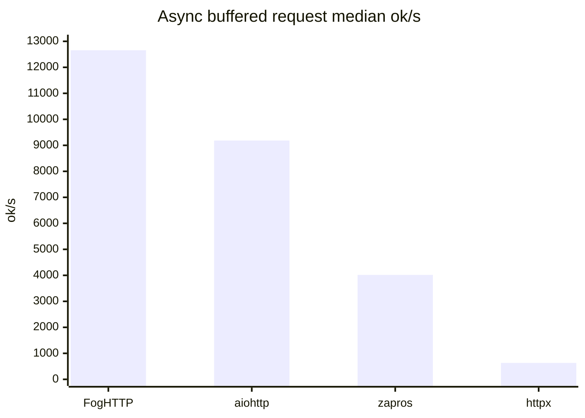
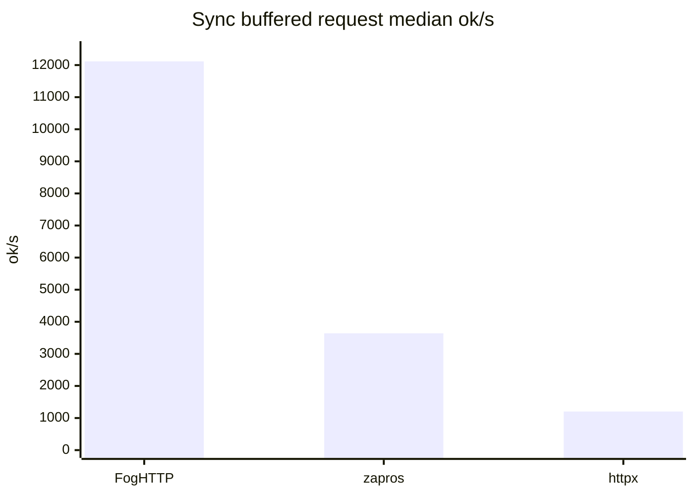
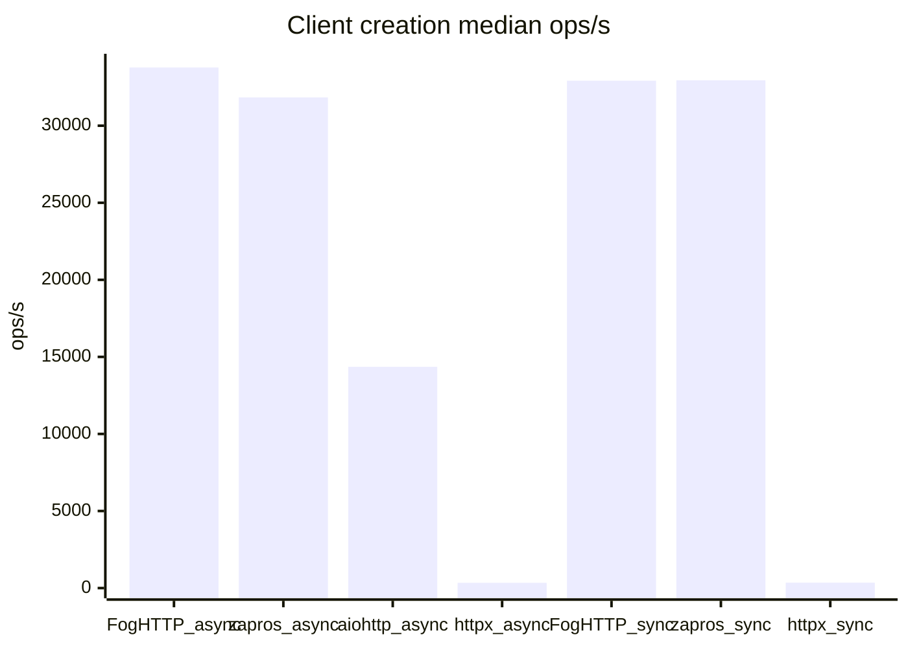
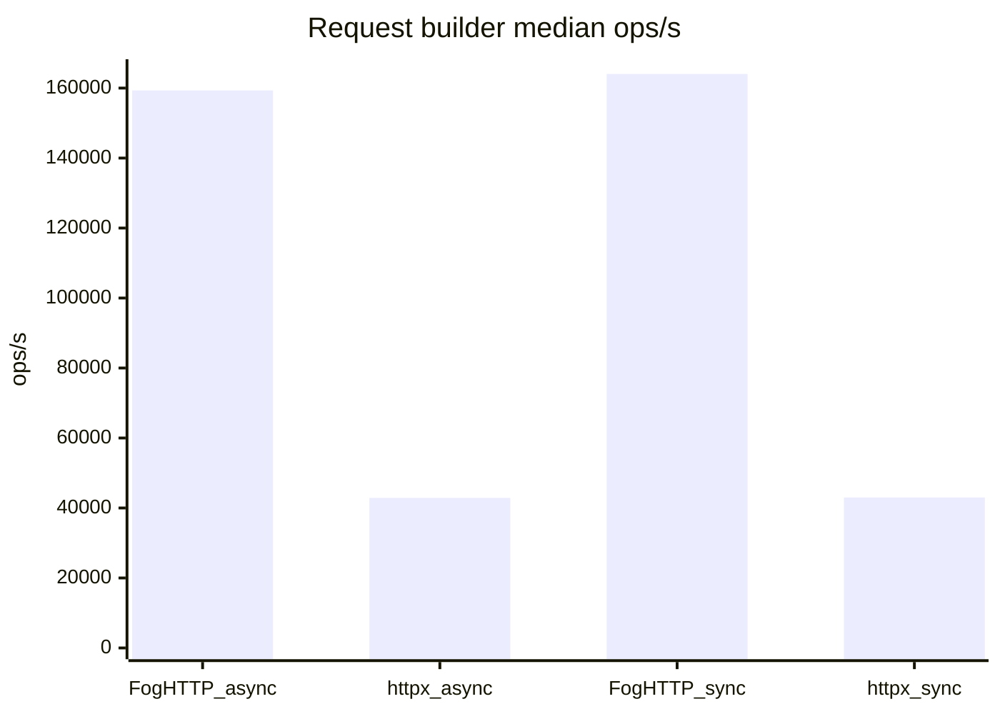
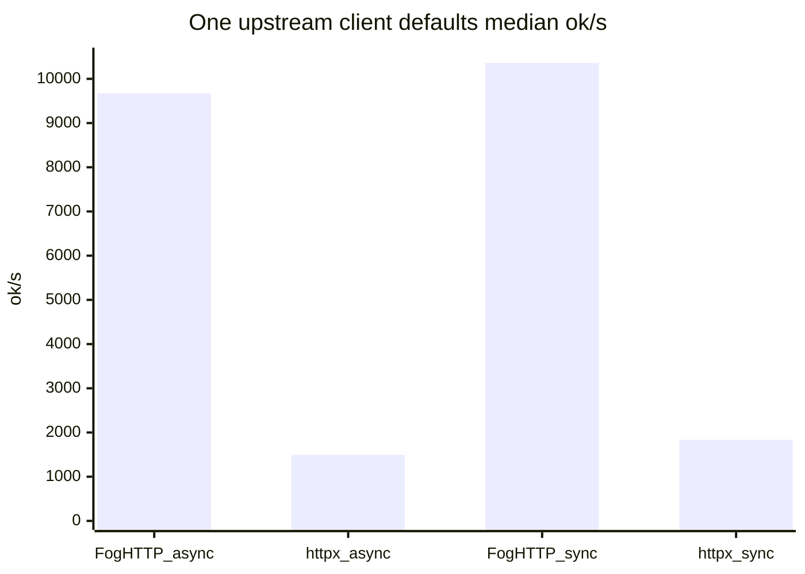
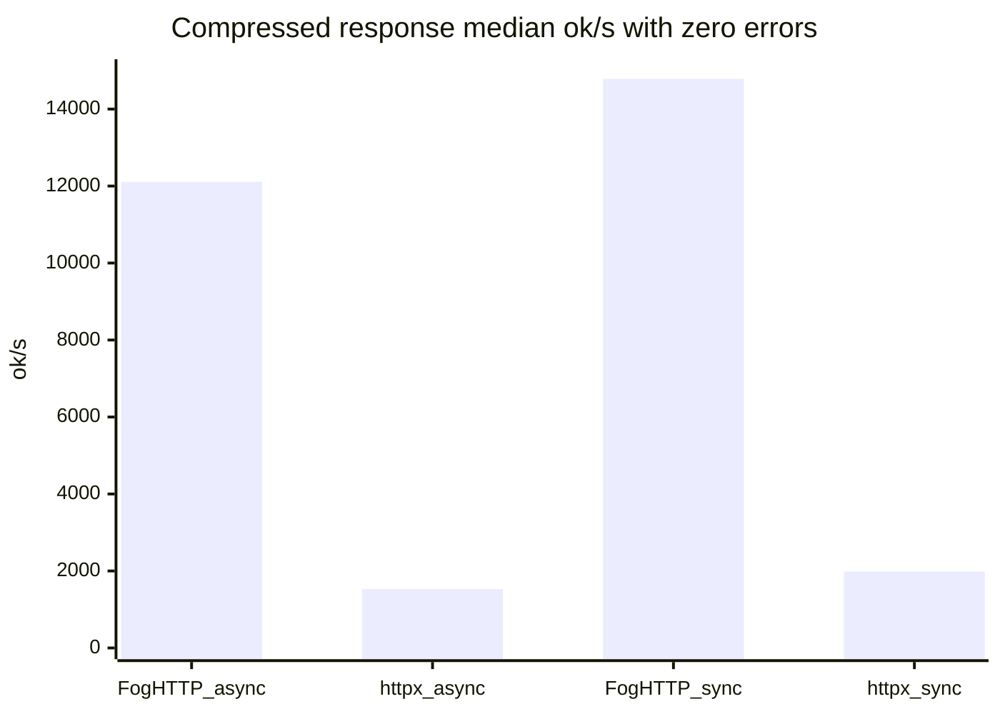
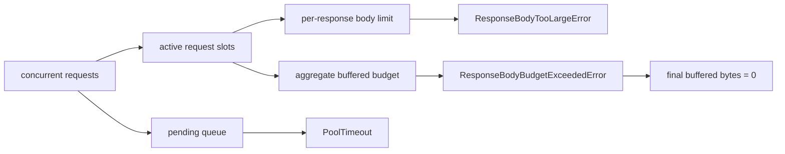

# Benchmarks

Benchmark harness and full benchmark reports live in a separate repository:
[github.com/AmberFog/FogHttpBenchmark](https://github.com/AmberFog/FogHttpBenchmark).

The tables below are copied summary snapshots from that repository. They are
useful for release-to-release comparison, but they are local loopback
benchmarks, not a universal prediction for real network latency.

## Methodology

- Server: local asyncio HTTP/1.1 loopback server.
- Platform: `macOS-26.3.1-arm64-arm-64bit-Mach-O`.
- Python: `3.14.0`.
- Shuffle seed: `20260507`.
- `sync:aiohttp` is skipped because aiohttp is async-only.
- Some suites skip clients that do not expose comparable APIs.
- Higher `ok/s`, `ops/s`, or successful `streams/s` is better.
- Lower `p95 ms`, threads, fds, and errors are better.
- Throughput and latency rows are only release-comparable when the row has
  `0` measured errors and `0` warmup errors. Rows with failures are treated as
  compatibility or reliability signals, not as successful wins.
- Streaming benchmark reports expose successful stream counts separately from
  total errors. Unsupported client rows, line-limit failures, and failed
  warmups must stay visible near the throughput numbers instead of being folded
  into aggregate wins.

## Snapshots

| Suite | Latest snapshot | Previous FogHTTP baseline |
|---|---:|---:|
| request workloads | `20260521-221403` | `20260518-131322` |
| client creation | `20260521-210842` | `20260518-120955` |
| resource/backpressure | `20260521-210812` | `20260518-120926` |
| request builder | `20260521-205749` | `20260518-120300` |
| one upstream | `20260521-210156` | `20260518-120707` |
| compressed response | `20260521-210553` | none |

## Versions

| Client | Latest snapshot | Previous FogHTTP baseline |
|---|---:|---:|
| FogHTTP | `0.3.1` | `0.3.0` |
| aiohttp | `3.13.5` | `3.13.5` |
| httpx | `0.28.1` | `0.28.1` |
| zapros | `0.11.1` | `0.11.1` |

## Release Comparison

The `0.3.1` release added buffered memory budgeting, gzip/deflate/br response
decompression, response text/encoding polish, richer transport diagnostics, and
TLS trust-boundary hardening. The request path remains competitive, but the
new safety and observability work has a measurable cost in the general request
suite.

| Suite | Rows | Throughput/ops delta | p95 delta | Notes |
|---|---:|---:|---:|---|
| requests | `88` | `-3.9%` geomean | `+7.1%` | Local request throughput is lower than `0.3.0`, but FogHTTP competitive wins moved from `75/88` to `76/88`. |
| client creation | `12` | `+2.1%` geomean | `-3.0%` | The short-lived client regression seen in `0.3.0` improved. |
| request builder | `20` | `+0.1%` geomean | `-0.4%` | Request construction stayed effectively flat. |
| one upstream | `48` | `-0.2%` geomean | `+1.0%` | `base_url`, defaults, prepared requests, JSON, and form bodies remain close to direct requests. |
| resource/backpressure | `30` common rows | n/a | `-5.3%` | Existing resource scenarios improved slightly; `0.3.1` adds aggregate buffered budget checks. |
| compressed response | new | n/a | n/a | New suite for transparent gzip, deflate, br, and stacked encodings. |

## Release Readiness Checks

Before copying benchmark numbers into release documentation:

- refresh summaries from the benchmark repository for the exact release commit
- verify `errors_total`, `warmup_errors_total`, and successful operation counts
  before writing throughput conclusions
- keep failed or unsupported competitor rows visible as compatibility rows
- run or at least syntax-check the examples against the current branch
- check README, quickstart, limitations, streaming docs, and raw GitHub
  rendering for stale streaming boundaries

### Visual Summary

Green nodes improved versus `0.3.0`, red nodes regressed, and gray nodes are
effectively flat in this local benchmark set. For throughput and ops/s, higher
is better. For p95 latency, lower is better.

## Request Workloads

Requests/run: `2000`, warmup/run: `200`, repeats: `3`,
concurrency: `1,10,50,100`.

Buffered scenarios: `json-small`, `json-decode-small`, `bytes-64k`,
`post-json-echo`, `post-echo-64k`, `redirect-get-302`,
`redirect-head-302`, `redirect-post-303`, `redirect-post-307`.

Delay/resource scenarios: `delay-20ms`, `pool-contention-20ms`.

### Latest Snapshot: FogHTTP 0.3.1

| Group | Client | Wins | Median ok/s | Median p95 ms | Max threads | Max fds | Errors |
|---|---|---:|---:|---:|---:|---:|---:|
| async buffered | FogHTTP | `31/36` | `12656.5` | `2.14` | `18` | `210` | `0` |
| async buffered | aiohttp | `5/36` | `9183.9` | `2.46` | `2` | `207` | `0` |
| async buffered | zapros | `0/36` | `4016.3` | `6.90` | `2` | `273` | `0` |
| async buffered | httpx | `0/36` | `630.6` | `264.46` | `2` | `207` | `0` |
| async delay/pool | FogHTTP | `5/8` | `439.8` | `25.99` | `18` | `210` | `0` |
| async delay/pool | aiohttp | `2/8` | `419.4` | `26.43` | `2` | `207` | `780` |
| async delay/pool | httpx | `1/8` | `283.8` | `313.31` | `2` | `207` | `0` |
| async delay/pool | zapros | `0/8` | `402.3` | `29.30` | `2` | `207` | `0` |
| sync buffered | FogHTTP | `36/36` | `12117.2` | `1.82` | `118` | `212` | `0` |
| sync buffered | zapros | `0/36` | `3640.5` | `8.68` | `102` | `272` | `0` |
| sync buffered | httpx | `0/36` | `1203.8` | `24.19` | `102` | `207` | `0` |
| sync delay/pool | FogHTTP | `4/8` | `440.7` | `24.92` | `118` | `210` | `0` |
| sync delay/pool | zapros | `2/8` | `415.0` | `25.28` | `102` | `207` | `0` |
| sync delay/pool | httpx | `2/8` | `187.6` | `121.84` | `102` | `207` | `0` |

### FogHTTP 0.3.1 vs 0.3.0

| Segment | Rows | Throughput delta | p95 delta |
|---|---:|---:|---:|
| overall | `88` | `-3.9%` | `+7.1%` |
| async | `44` | `-3.7%` | `+7.0%` |
| sync | `44` | `-4.1%` | `+7.1%` |

In this local request suite, FogHTTP has the highest throughput in most rows,
especially sync buffered workloads and redirects. The main release-to-release
cost is visible as a small aggregate throughput drop and higher p95 on the
general request suite, which should be watched as more safety and diagnostics
features land.

## Client Creation And First Request

Iterations/run: `100`, client counts: `1,10,50`, repeats: `3`.

Scenarios: `create-close`, `create-first-request`,
`many-clients-open-close`, `reused-request`.

### Latest Snapshot: FogHTTP 0.3.1

| Mode | Client | Wins | Median ops/s | Median p95 ms | Peak threads | Peak fds | Errors |
|---|---|---:|---:|---:|---:|---:|---:|
| async | FogHTTP | `3/6` | `33777.2` | `0.030` | `1` | `5` | `0` |
| async | zapros | `2/6` | `31836.5` | `0.023` | `0` | `2` | `0` |
| async | aiohttp | `1/6` | `14354.4` | `0.055` | `0` | `2` | `0` |
| async | httpx | `0/6` | `340.1` | `3.102` | `0` | `1` | `0` |
| sync | FogHTTP | `3/6` | `32921.4` | `0.034` | `1` | `5` | `0` |
| sync | zapros | `3/6` | `32948.4` | `0.023` | `0` | `2` | `0` |
| sync | httpx | `0/6` | `347.2` | `2.960` | `0` | `2` | `0` |

### FogHTTP 0.3.1 vs 0.3.0

| Segment | Rows | ops/s delta | p95 delta |
|---|---:|---:|---:|
| overall | `12` | `+2.1%` | `-3.0%` |
| async | `6` | `+3.0%` | `-4.7%` |
| sync | `6` | `+1.1%` | `-1.4%` |
| many-clients-open-close | `6` | `+5.0%` | `-5.9%` |

FogHTTP recovered part of the short-lived-client cost introduced by the `0.3.0`
request-builder foundation. Zapros remains very competitive on some minimal
client-lifecycle rows, while FogHTTP has much higher median ops/s than HTTPX in
this local suite.

## Request Builder

Iterations/run: `5000`, warmup/run: `500`, repeats: `3`.

This suite measures request construction without network I/O, plus a prepared
request send case through the local loopback server. aiohttp and zapros are
skipped because the suite requires comparable `build_request` support.

| Mode | Client | Kind | Rows | Median ops/s | Median p95 ms | Max threads | Max fds | Errors |
|---|---|---|---:|---:|---:|---:|---:|---:|
| async | FogHTTP | build | `9` | `159329.5` | `0.0068` | `2` | `8` | `0` |
| async | httpx | build | `9` | `42890.4` | `0.0312` | `2` | `8` | `0` |
| async | FogHTTP | send-prepared | `1` | `7625.7` | `0.1950` | `3` | `12` | `0` |
| async | httpx | send-prepared | `1` | `1917.1` | `0.7505` | `2` | `9` | `0` |
| sync | FogHTTP | build | `9` | `164034.8` | `0.0067` | `2` | `7` | `0` |
| sync | httpx | build | `9` | `42997.4` | `0.0306` | `2` | `7` | `0` |
| sync | FogHTTP | send-prepared | `1` | `9825.1` | `0.1466` | `3` | `12` | `0` |
| sync | httpx | send-prepared | `1` | `3525.0` | `0.4437` | `2` | `9` | `0` |

FogHTTP request building stayed effectively flat versus `0.3.0`
(`+0.1%` geomean ops/s, `-0.4%` p95). This is an important signal for the
`0.3.x` request-builder foundation.

## One Upstream Client Defaults

Requests/run: `1000`, warmup/run: `100`, repeats: `3`,
concurrency: `1,10,50`.

This suite compares direct requests with `base_url`, client defaults, prepared
requests, JSON bodies, and form bodies against one upstream.

| Mode | Client | Rows | Median ok/s | Median p95 ms | Max threads | Max fds | Errors |
|---|---|---:|---:|---:|---:|---:|---:|
| async | FogHTTP | `24` | `9673.1` | `1.30` | `18` | `110` | `0` |
| async | httpx | `24` | `1498.1` | `6.55` | `2` | `107` | `0` |
| sync | FogHTTP | `24` | `10359.7` | `1.05` | `68` | `110` | `0` |
| sync | httpx | `24` | `1832.9` | `6.56` | `52` | `107` | `0` |

Compared with `0.3.0`, this suite is stable (`-0.2%` geomean ok/s,
`+1.0%` p95). Client defaults and prepared requests remain cheap on the hot
path.

## Compressed Responses

Requests/run: `1000`, warmup/run: `100`, repeats: `3`,
concurrency: `1,10,50`.

Scenarios: `gzip-json-small`, `gzip-64k`, `deflate-64k`, `br-64k`,
`gzip-high-ratio-1m`, `multi-gzip-deflate-64k`.

| Mode | Client | Wins | Median ok/s | Median p95 ms | Max threads | Max fds | Errors |
|---|---|---:|---:|---:|---:|---:|---:|
| async | FogHTTP | `16/18` | `12109.4` | `0.89` | `18` | `110` | `0` |
| async | aiohttp | `2/18` | `6073.2` | `1.42` | `2` | `107` | `9000` |
| async | zapros | `0/18` | `3521.2` | `2.74` | `2` | `157` | `9000` |
| async | httpx | `0/18` | `1531.1` | `6.03` | `2` | `107` | `0` |
| sync | FogHTTP | `18/18` | `14783.6` | `0.71` | `68` | `112` | `0` |
| sync | zapros | `0/18` | `4073.8` | `3.25` | `52` | `157` | `9000` |
| sync | httpx | `0/18` | `1982.9` | `6.83` | `52` | `107` | `0` |

Compatibility failures are reported separately from successful throughput:

| Mode | Client | Failed scenario family | Errors |
|---|---|---|---:|
| async | aiohttp | stacked `Content-Encoding` | `9000` |
| async | zapros | stacked `Content-Encoding` | `9000` |
| sync | zapros | stacked `Content-Encoding` | `9000` |

In this local compressed-response suite, FogHTTP has the highest observed
median throughput for successful concurrent buffered responses and stacked
`Content-Encoding` decoding. The aiohttp and zapros rows are still shown in the
table for transparency, but their non-zero error totals mean they should be
read as partial compatibility results for this suite rather than clean
throughput comparisons.

## Resource And Backpressure Workloads

Requests/run: `200`, warmup/run: `0`, repeats: `3`,
concurrency: `10,50,100`.

Scenarios: `active-limit-serial`, `aggregate-buffered-budget`,
`pending-queue-full`, `per-origin-isolation`, `pool-timeout-recovery`,
`response-body-limit`.

| Mode | Scenario | Total ok | Median errors % | Median p95 ms | Peak active | Peak pending | Peak buffered bytes | Pool timeouts | Budget rejects | Final buffered bytes | Recovery failures | Max threads | Max fds |
|---|---|---:|---:|---:|---:|---:|---:|---:|---:|---:|---:|---:|---:|
| async | active-limit-serial | `1800` | `0.00` | `1049.71` | `1` | `99` | `106` | `0` | `0` | `0` | `0` | `3` | `13` |
| async | aggregate-buffered-budget | `10` | `99.50` | `25.37` | `10` | `90` | `98304` | `0` | `199` | `0` | `0` | `12` | `55` |
| async | pending-queue-full | `0` | `100.00` | `2.51` | `0` | `0` | `0` | `200` | `0` | `0` | `0` | `3` | `11` |
| async | per-origin-isolation | `1800` | `0.00` | `531.84` | `2` | `98` | `212` | `0` | `0` | `0` | `0` | `4` | `15` |
| async | pool-timeout-recovery | `34` | `99.00` | `8.25` | `1` | `99` | `0` | `199` | `0` | `0` | `0` | `3` | `13` |
| async | response-body-limit | `0` | `100.00` | `13.94` | `1` | `99` | `0` | `0` | `0` | `0` | `0` | `3` | `14` |
| sync | active-limit-serial | `1800` | `0.00` | `1043.19` | `1` | `99` | `106` | `0` | `0` | `0` | `0` | `103` | `13` |
| sync | aggregate-buffered-budget | `8` | `99.50` | `29.87` | `10` | `90` | `98304` | `0` | `200` | `0` | `0` | `112` | `49` |
| sync | pending-queue-full | `0` | `100.00` | `0.02` | `0` | `0` | `0` | `200` | `0` | `0` | `0` | `3` | `11` |
| sync | per-origin-isolation | `1800` | `0.00` | `522.14` | `2` | `98` | `212` | `0` | `0` | `0` | `0` | `104` | `15` |
| sync | pool-timeout-recovery | `32` | `99.00` | `7.38` | `1` | `99` | `106` | `199` | `0` | `0` | `0` | `103` | `13` |
| sync | response-body-limit | `0` | `100.00` | `13.66` | `1` | `99` | `0` | `0` | `0` | `0` | `0` | `103` | `13` |

Resource benchmarks confirm the request-slot and memory-budget model:

- `active-limit-serial` holds active requests at `1`.
- `per-origin-isolation` holds total active requests at `2` with one active
  request per origin.
- `pending-queue-full` fails fast with `PoolTimeout` and does not leak pending
  or active slots.
- `pool-timeout-recovery` reports expected `PoolTimeout` outcomes and no
  recovery failures.
- `response-body-limit` fails with `ResponseBodyTooLargeError` without active
  request leaks.
- `aggregate-buffered-budget` caps peak buffered bytes at `98304` and returns
  to `0` final buffered bytes after expected budget rejections.
